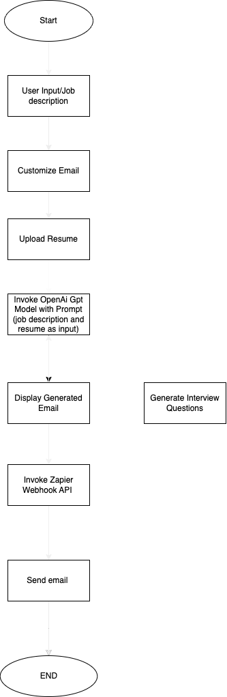

# **JobMailer-AI**
**AI chatbot to Send professional Emails**

JobMailer AI is a streamlined application designed to generate professional emails and interview questions using GPT-3.5, OpenAI's language model. It utilizes Streamlit for the user interface and integrates with Zapier for email delivery. This tool simplifies the process of creating job application emails and interview questions by leveraging AI, saving time for job seekers and recruiters alike.

# Features
Email Generation:

  . Generate professional emails for job applications based on user input.
  . Customize email tone (Formal, Casual, Professional).
  . Control email length (Short, Medium, Long).
  . Optionally, upload your resume to enhance the email with relevant details.

Interview Questions Generation:

. Generate interview questions based on the provided job description.
. Optionally, include the candidate's resume to tailor the email and interview questions.

Email Sending:

  Send the generated email directly to a recipient via Zapier integration.

# Prerequisites
Before running the application, ensure you have the following installed:

Python: Version 3.7 or higher
Streamlit: Web app framework for Python
OpenAI Python Client: For interacting with the OpenAI API
PyPDF2: For extracting text from PDF files (resume upload feature)
Requests: For making HTTP requests to Zapier for email sending
python-dotenv: For loading environment variables from a .env file

# System Diagram



# Setup
1. Clone the repository
  `git clone https://github.com/your-username/jobmailer-ai.git
cd jobmailer-ai
2. Install required dependencies

`pip install -r requirements.txt
3. Set up environment variables
Create a .env file in the project root directory and add your OpenAI API key:

`env

`OPENAI_API_KEY=your_openai_api_key_here
Make sure you have a valid OpenAI API key to interact with the GPT-3.5 model.

4. Running the Application
Run the Streamlit app with the following command:

`streamlit run app.py
After the app is running, you can access it locally in your web browser at http://localhost:8501.

connect git repository in streamlit cloud and deploy the app 
run the app in streamlit cloud


# How It Works
**User Input**:
  The user provides a job description or email prompt in the input box.
  The user has the option to upload their resume (PDF) to enhance the generated email.
**Email Generation**:
  The system uses OpenAI to generate an email based on the user input and the user resume, with customization options like tone, length, and purpose.
**Interview Questions**:
  Optionally, based on the provided job description, the system generates relevant interview questions.
**Email Sending**:
  Once the email is generated, the user can send it directly to a recipient via the Zapier webhook integration.


@ Project Structure

```
jobmailer-ai/
├── app.py                  # Streamlit application file
├── requirements.txt        # Python dependencies
├── .env                    # Environment variables (API key)
└── README.md               # Project documentation
```

